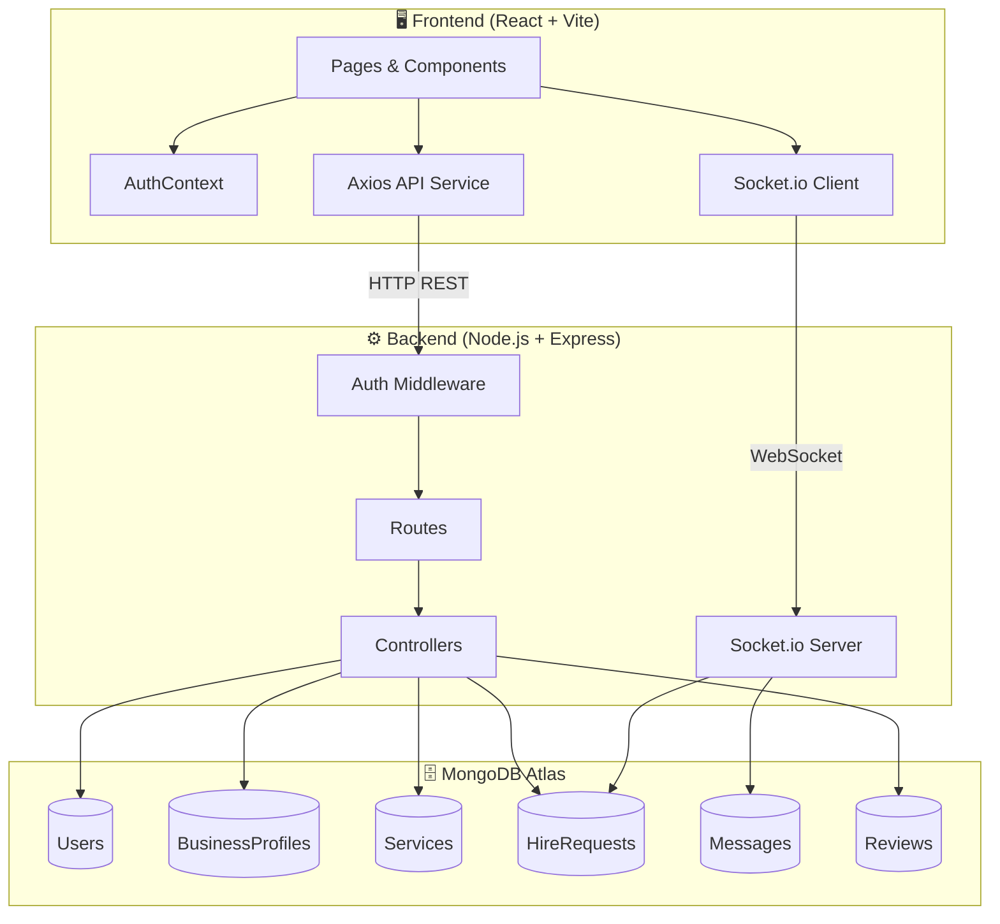
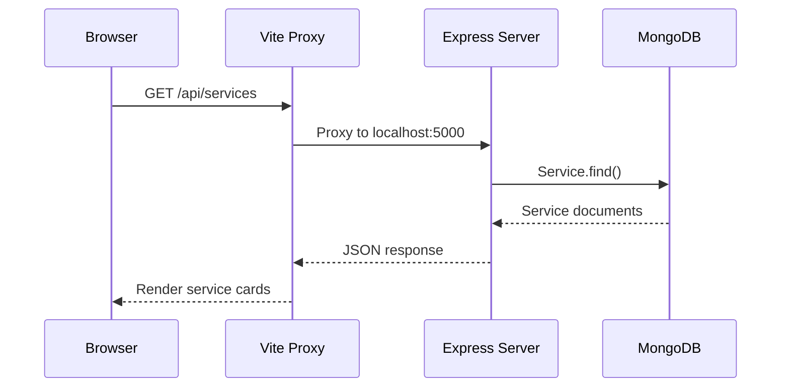
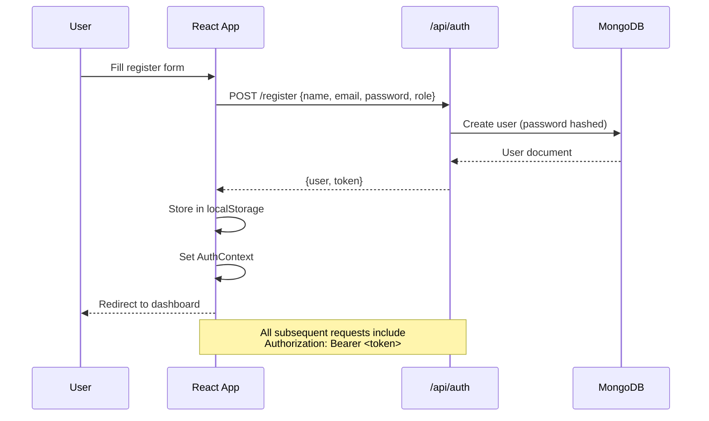
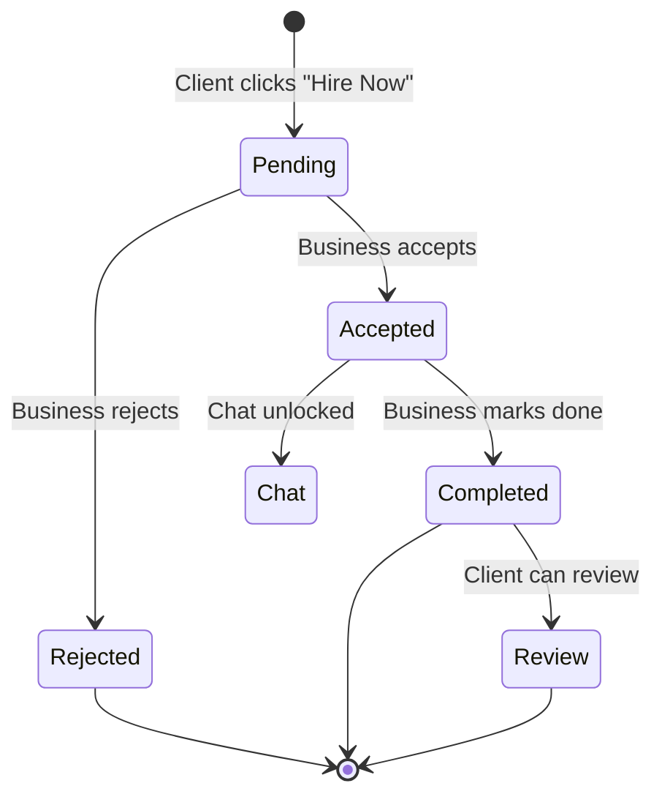
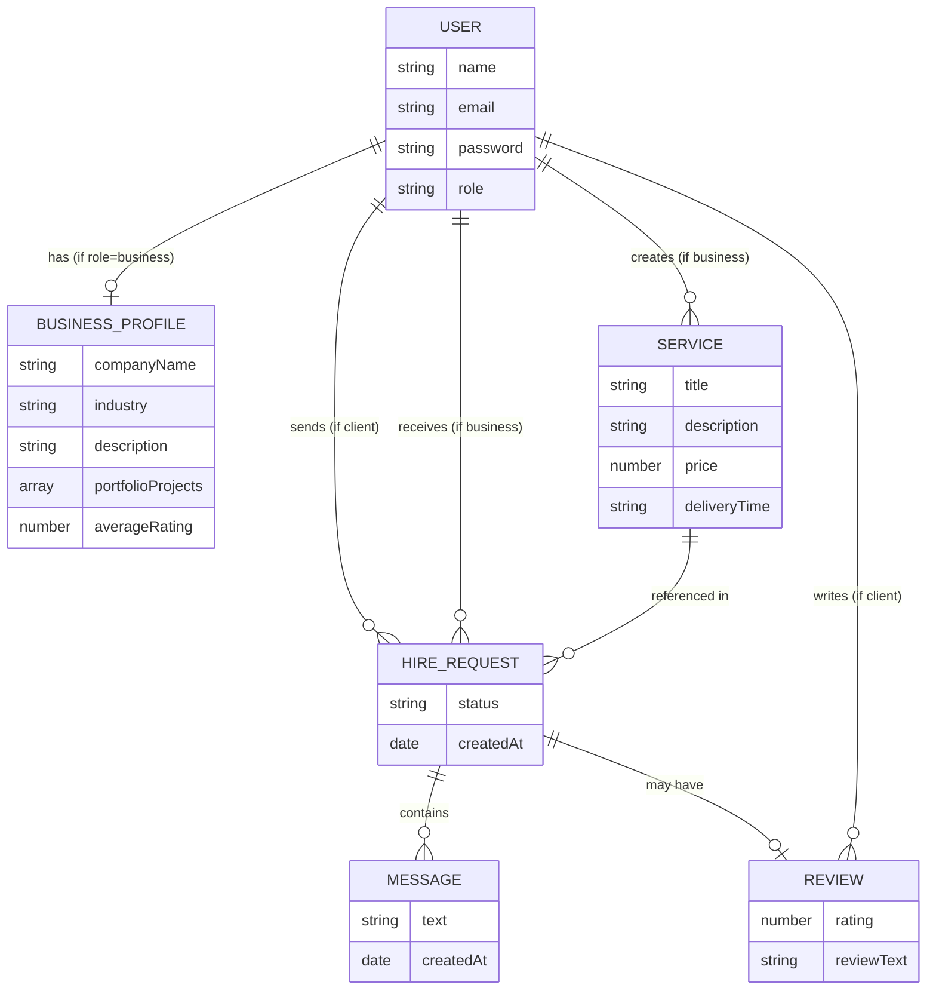
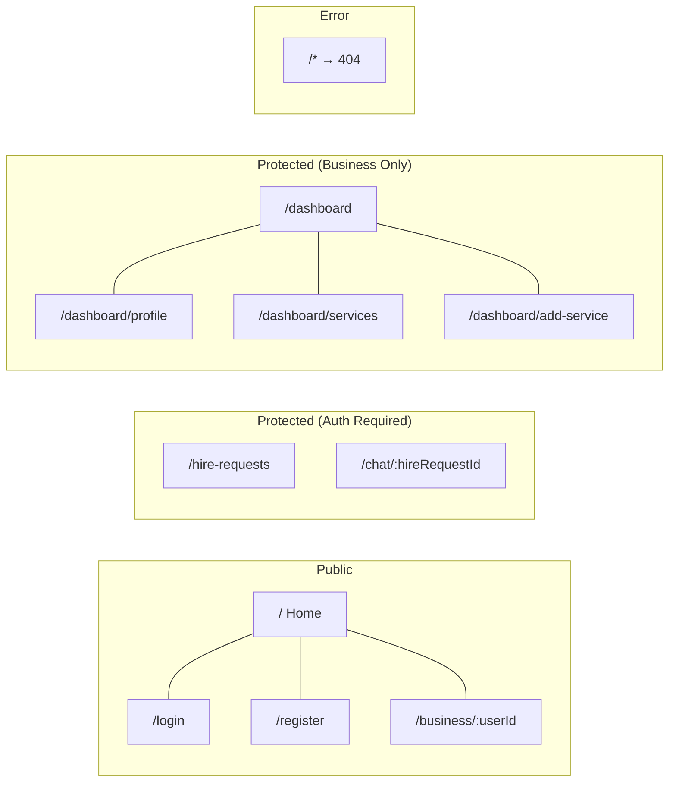

# 🏗 Architecture & Flow Diagrams

## System Architecture



---

## Request Flow



---

## Authentication Flow



---

## Hire Request Lifecycle



---

## Database Relationships



---

## Frontend Route Map



---

## Component Hierarchy

```
App
├── Navbar
├── Routes
│   ├── Home
│   │   ├── SearchFilters
│   │   └── ServiceCard[]
│   ├── Login
│   ├── Register
│   ├── BusinessProfilePublic
│   │   ├── ServiceCard[]
│   │   └── ReviewCard[]
│   ├── BusinessDashboard (ProtectedRoute)
│   │   ├── Sidebar
│   │   ├── ManageProfile
│   │   ├── ManageServices
│   │   └── AddService
│   ├── HireRequests (ProtectedRoute)
│   │   └── StarRating (inline review)
│   ├── Chat (ProtectedRoute)
│   └── NotFound (404)
├── Footer
└── ToastProvider (global notifications)
```
